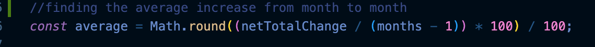
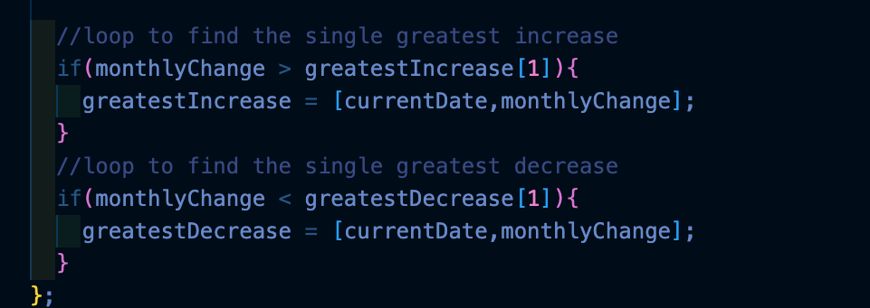
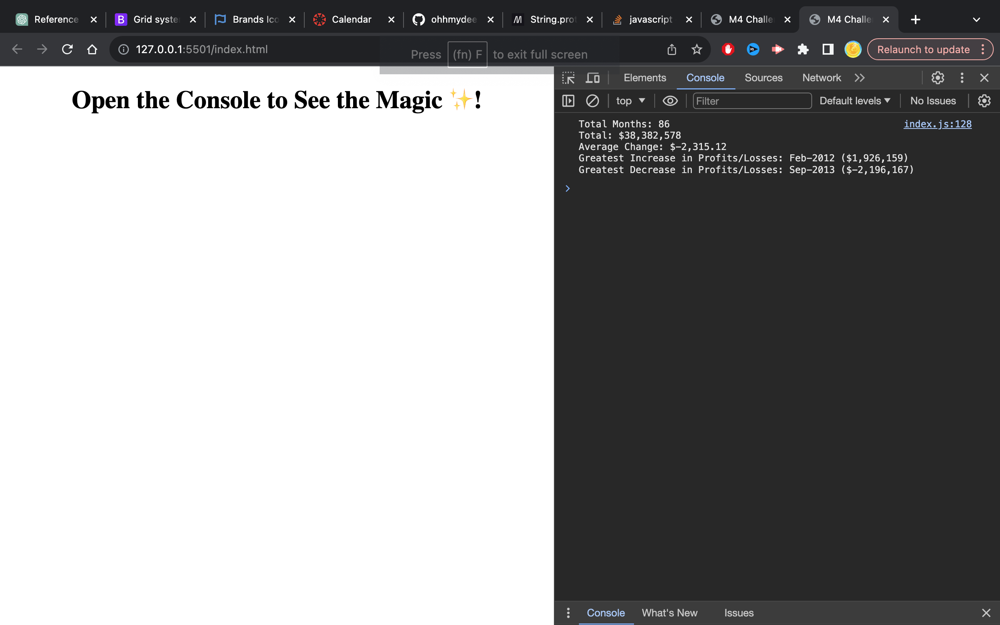

# console-finances

## Table of Contents: 
* [Installation](#installation)
* [Usage](#usage)
* [Credits](#credits)
* [License](#license)

Installation: 

For this task, the HTML file was provided in the starter pack with the finance array, a CSS stylesheet was not required 

since the focus was the Javascript page, however this needed to be transferred to a new Repo.

Step 1: Creating a Repo. 

In this step, Create a Repo which also has a readMe file attached.

Step 2: creating the folders and files for the repo:

Since the HTML file and CSS files were already completed, This step required creating a blank HTML pages CSS pages to 
copy the code onto using "touch<file name>".css & "touch<file name>.HTML". 

Step 3: Creating the code: 

starting with the base code:

Step 4: Creating the prompts

Since the task was to create a finance calculator that checks for a number of parameters, I was tasked 
with completing research to understand how to create the indivisual elements of the finance calculator 
that works inside the webpages console, this was done through research on mdn web docs_ and help from 
the great teaching assistants and my fellow students in a study group. 

The first step that was required was to identify the number of months within the given 
array, whislt this was necessary for producing in the first part of the array, being 
able to idenitfy the number of months will also be useful in the next steps as the 
months is also included in the for loop that is used in the rest of the finance 
calculator.

Step 5: adding to the loops to check for the required paramenters.

The next step was completed by adding a function in the foor loop which adds the current postion on the array (i) onto the following month until the array is complete and produce the answer. 

Following this an if statement was utilised to check the average change from month to month and logged using by taking the net total change x the total number of months - 1 (the first month is not included in this calculation) following this, math.round function was used to ensure that the final number produced was to 2 decimal places as per the guidelines requested.

Following this, two if statements were utilised to check the singles greatest increase from month to month and the single greatest loss from month to month.

Final step: creating the console log: 

The final product: 

Usage: 

    the page can be used to check the net profits and losses for any given finances array manually added to the JS file.

Credits: 

    Repo is made by myself, initial fiannce array and basic HTML file was provided by the university and the code thereafter was created with the help of my colleagues in the a study group, the help of teaching assistants and research completed on mdn web docs and stack overflow.

License:

    See License in Repo